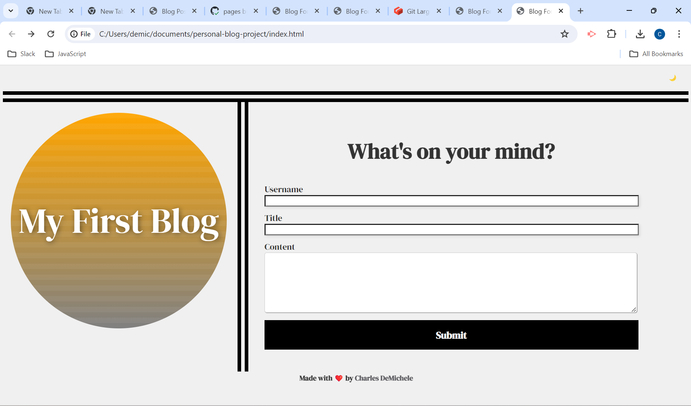
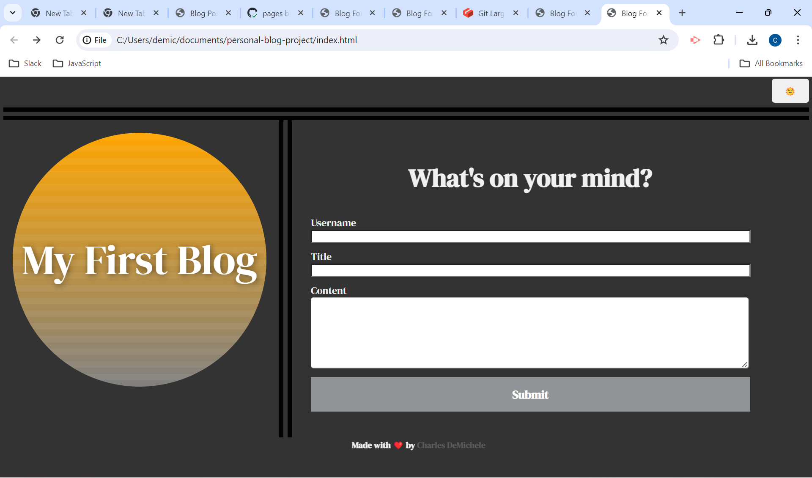
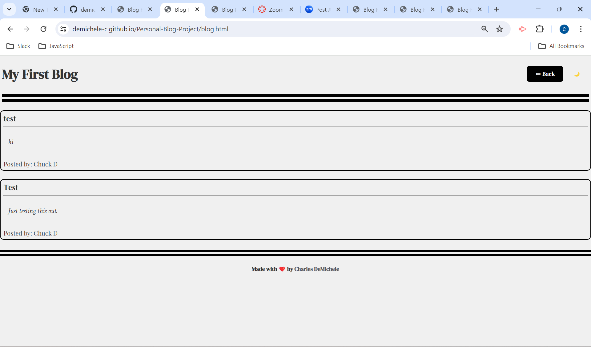

# Personal-Blog-Project
## A personal blog for marketing students that showcases thoughts and experiences.
In this project I was tasked with developing a website that collects a username, title, and content for a blog posting. After that information is collected it is logged in local storage and posted on a secondary webpage with all previous entries that have been recorded in local storage. This webpage needed to have a light and dark mode, a back button on the second page, and a footer with a link to my portfolio.
## Proceses and Challenges 

```
FIRST I created two html pages with semantic elements.
THEN I created three css stylesheets to add style and layout to both pages.
THEN I created three javascript files to add logic and functionalty to both pages.
THEN I created a function to toggle between light and dark mode.
THEN I created a function to navigate to the original page with the click of a button.
THEN I created a function to collect data and store in local storage.
THEN I created a function to retrive data from local storage and display in a div on second page.
THEN I created a footer with a link to my portfolio.


```
## Deployed Website Screenshot






## Project URL
https://demichele-c.github.io/Personal-Blog-Project/
